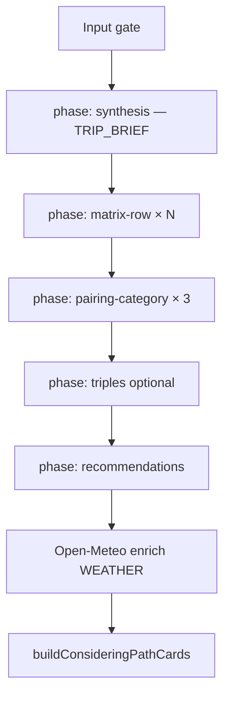

# Avanti Step 2 — Destination Generation (2B & 2C)

Reference for how destination options are generated when a user clicks **Generate options** on Step 2 paths **2B (considering)** and **2C (brainstorm)**.

- **Model:** `claude-sonnet-4-6`
- **Orchestration:** `lib/fetch-destination-matrix.ts`
- **API:** `app/api/generate-destination-matrix/route.ts`
- **Synthesis:** `lib/step2c/generate-trip-synthesis.ts`
- **Context assembly:** `lib/step2c/trip-generation-context.ts`
- **Matrix prompts:** `lib/generate-destination-matrix.ts`
- **Chat (Q&A only, no cards):** `app/api/step2-chat/route.ts`

---

## Input gate (collect everything first)

Generation does **not** start until the full Step 2 bundle is present:

| Required | Field |
|----------|-------|
| Q1 | Trip story (`q1`) |
| Q2 | Departure cities, dates, flex length, travel pace, activities, vibe, accommodation, budget |
| Q2 (2C only) | Domestic/international, regions (if international), popularity |
| Q2 (2B only) | At least 2 places on considering list |
| Q3 | Deal-breakers (short answers like "None" are OK) |
| Step 1 | `trip_type`, event fields (hard anchor when event-centered), traveler count |
| Optional | Step 2 chat before Generate |
| Logged-in | Organizer profile (accessibility, dietary, age band, nationality) |

Server validation: `assertStep2InputsComplete()` in `lib/step2c/trip-generation-context.ts` — returns HTTP 400 if incomplete.

---

## Pipeline (batched, ~3–4 minutes)

### Phase 0: Synthesis (hidden from user)

- **Progress label:** "Understanding your trip story…"
- **Prompt:** `lib/step2c/trip-synthesis-prompt.ts` — non-linear cross-factor reasoning
- **Output:** `TRIP_BRIEF` (stored on `travelers.step2.tripBrief` for debugging/regenerate)
- **2B vs 2C:** Same framework; 2B scores given places + optional `SUGGESTED_ADJACENTS`; 2C builds `CANDIDATE_CITIES_SHORTLIST` from scratch

### Phases 1–N: Card generation (executes brief)

All phases receive assembled context + `TRIP_BRIEF`:

| Phase | Count | Role |
|-------|-------|------|
| `matrix-row` | 6 (2C) or N (2B list) | Score single destinations |
| `pairing-category` | 3 | Travel simplicity, budget, activity/vibe pairs |
| `triples` | 0–1 | Three-stop routes when pace + dates allow |
| `recommendations` | 1 | Summary, RECOMMENDED_TAB, RECOMMENDED_SHAPE |

**Progress labels:** "Scoring destinations…" → "Building route pairings…" → "Finalizing recommendations…"

### Post-processing

- **Open-Meteo:** `enrichMatrixRowsWithClimate()` replaces AI `WEATHER` when geocoding succeeds
- **Chip enrichment:** `enrichMatrixChipRows` / `enrichMatrixPairings`

---

## Design decisions

### Event-centered trips
`EVENT ANCHOR (hard constraint)` — recommendations stay realistic relative to event location and dates.

### Budget
Soft guide — prefer in-budget; slightly-over options allowed with honest `TRADEOFF` / `BUDGET FIT`.

### Single-respondent constraint
Only one traveler's Step 2 answers + profile are known; other members' prefs only if stated in Q1/Q3/chat.

### Availability window ≠ trip length
Wide date range = when they *can* travel; `flexLength` / fixed span = actual trip length for weather, stops, and routing.

---

## Legacy 4-card flow

`lib/generate-destinations-core.ts` + `app/api/generate-destinations/route.ts` — used by older paths, **not** 2B/2C matrix generation. Its 10-factor reasoning block is merged into `MATRIX_REASONING_FRAMEWORK` for synthesis.

---

## Try-it preview

`fetchPreviewDestinationMatrix()` runs the same synthesis + batched pipeline without organizer profile (group size defaults to 6).
